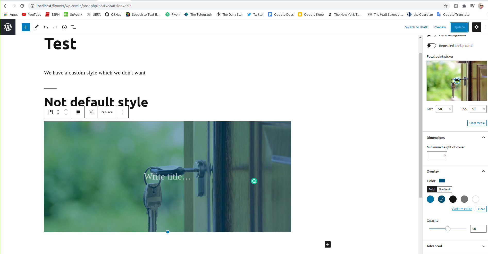
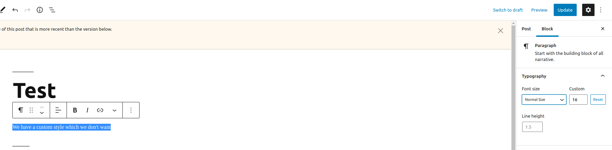
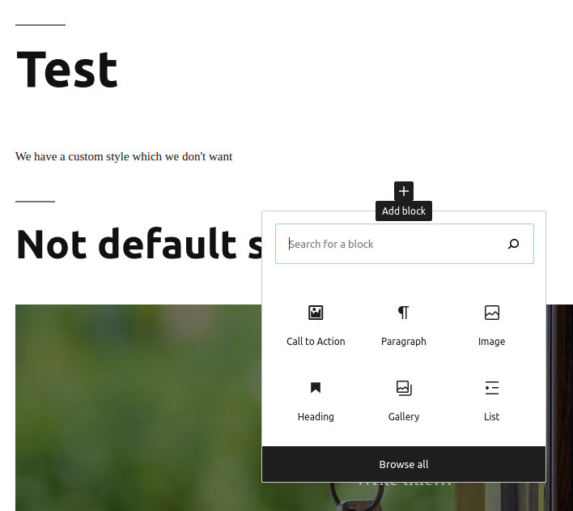

## Wordpress

 - [Tutorial](https://www.youtube.com/watch?v=J71to18QaXs&list=PLriKzYyLb28lHhftzU7Z_DJ32mvLy4KKH&index=2)
 - [github repo - branch](https://github.com/Alecaddd/gutenberg-tutorial)
 - Add a new post -> here we are going to customize -> add title, paragraph, cover etc

 

 - In **function.php** create a new function file for all gutenberg functions
 - Customize color, text, responsiveness, dark modes, block tools, core blocks, frontend etc. [know more](https://developer.wordpress.org/block-editor/developers/themes/theme-support/)
 - For custom **overlay color** of cover image add a theme support

 

 - Change style for paragraph font size - make custom value in block (right sidebar)

#### Custom block
 
 - To create a custom block we need to registerBlockType using JavaScript -> How to Create a Custom BlockHow to Create a Custom Block
 - 

 

#### NPM Build

 - Create new **package.json** and Install wordpress scripts 

 ```npm install --save-dev --save-exact @wordpress/scripts```

 - Script setup for wordpress script in **package.json** . 

```"build:scripts": "wp-scripts build",```

 - Create two more folders build the file **build** and **src* . inside src there will be our **index.js** file

```npm run build```

 - Add this script to continuously running and updating build files 
   
```    "start-build": "wp-scripts start"```

 - Use th command to run the script

